# StoreHelper Demo
Implementing and testing In-App Purchases with `StoreKit2` and `StoreHelper` in Xcode 13, Swift 5.5, iOS 15.

See also [In-App Purchases with Xcode 12 and iOS 14](https://github.com/russell-archer/IAPDemo) for details of working with the `StoreKit1` in iOS 14 and lower.

# Description


Implementing and testing In-App Purchases with `StoreKit2` and `StoreHelper` in Xcode 13, Swift 5.5, iOS 15, macOS 12, tvOS 15 and watchOS 8.

> This app requires `StoreKit2`, Swift 5.5, Xcode 13 and iOS 15.
> See [In-App Purchases with Xcode 12 and iOS 14](https://github.com/russell-archer/IAPDemo) for details of working with the original `StoreKit1` in iOS 14 and lower.

# Changes for Xcode 13 Beta 3
 
 - The use of `Task.Handle` has been deprecated
	 - The `StoreHelper` transaction listener now has a type of `Task<Void, Error>`
	 - The return type for `StoreHelper.handleTransactions()` changed from `Task.Handle<Void, Error>` to `Task<Void, Error>`
 - The `detach` keyword for creating detached tasks has been deprecated
	 - The use of `detach` in `StoreHelper.handleTransactions()`  has been replaced with `Task.detached`
 - The use of `async {}` blocks in a synchronous context has been deprecated
	 - All `async {}` blocks have been replaced with `Task.init {}`

# Changes for Xcode 13 Beta 2

- `Transaction.listener` is now `Transaction.updates`
- `Product.request(with:)` is now `Product.products(for:)`

# Source Code
See [StoreHelperDemo on GitHub](https://github.com/russell-archer/StoreHelper) for source code. 

> **Disclaimer**. The source code presented here is for educational purposes. 
> You may freely reuse and amend this code for use in your own apps. However, you do so entirely at your own risk.

# Contents
- [References](#References)
- [Overview](#Overview)
- [What's changed from the original StoreKit?](#What's-changed-from-the-original-StoreKit)
	- [Receipt validation](#Receipt-validation)
	- [Async Await support](#Async-Await-support)
	- [Should I use StoreKit1 or StoreKit2?](#Should-I-use-StoreKit1-or-StoreKit2)
- [StoreHelperDemo App](#StoreHelperDemo-App)
- [Get Started](#Get-Started)
- [Defining our Products](#Defining-our-Products)
- [Create the StoreKit configuration file](#Create-the-StoreKit-configuration-file)
- [Enable StoreKit Testing via the Project Scheme](#Enable-StoreKit-Testing-via-the-Project-Scheme)
- [Creating a Production Product List](#Creating-a-Production-Product-List)
- [Logging](#Logging)
- [StoreHelper](#StoreHelper)
- [Displaying Products](#Displaying-Products)
- [The Product type](#The-Product-type)
- [Purchasing Products](#Purchasing-Products)
       	- [Designing the UI](#Designing-the-UI)
       	- [Adding support to StoreHelper](#Adding-support-to-StoreHelper)
- [Validating Transactions](#Validating-Transactions)
- [Ask-to-buy support](#Ask-to-buy-support)
- [What Products has the user purchased](#What-Products-has-the-user-purchased)
- [Use the Receipt Luke](#Use-the-Receipt-Luke)
- [Consumables](#Consumables)
- [Subscriptions](#Subscriptions)
- [Displaying detailed Subscription information](#Displaying-detailed-Subscription-information)
- [What Next](#What-Next)   

# References
- https://developer.apple.com/in-app-purchase/
- https://developer.apple.com/documentation/storekit/in-app_purchase
- https://developer.apple.com/documentation/storekit/choosing_a_storekit_api_for_in-app_purchase
- https://developer.apple.com/documentation/storekit/in-app_purchase/implementing_a_store_in_your_app_using_the_storekit_api
- https://developer.apple.com/design/human-interface-guidelines/in-app-purchase/overview/introduction/
- https://developer.apple.com/videos/play/wwdc2021/10175 
- https://developer.apple.com/videos/play/wwdc2021/10114/
- https://developer.apple.com/support/universal-purchase/

---

# Overview


This SwiftUI app will demonstrate how to use Apple's new `StoreKit2` framework to provide in-app purchases to your users. 

The basic premise of the demo is that we're creating an app for an on-line florist that sells a range of flowers, chocolates and other related services like home visits to water and care for house plants.

Specifically, in building the app we'll cover:

- How to create a **multi-platform** SwiftUI app that allows users to purchase a range of products, including:

	- **consumable** (VIP plant installation service: lasts for one day)
	- **non-consumable** (cut flowers, potted plants, chocolates, etc.)
	- **subscription** (VIP plant home care: scheduled home visits to water and care for house plants)

- Creating a `StoreHelper` that encapsulates `StoreKit2` in-app purchase functionality and makes it easy to work with the App Store
- Requesting localized **product information** from the App Store
- How to **purchase** a product and **validate the transaction**
- Handling **pending ("ask to buy") transactions** where parental permission must be obtained before a purchase is completed
- Handling **canceled** and **failed transactions**
- Automatically handling customer **refunds**
- Exploring detailed **transaction information and history**
- Testing purchases locally using **StoreKit configuration** files

# What's changed from the original StoreKit?
There are two **huge** changes from the previous (original) version of StoreKit (`StoreKit1` hereafter):

## Receipt validation
With `StoreKit1` validating the receipt issued by the App Store was a tricky process that required either:

- Working with the C-based `OpenSSL` library to decrypt, read and validate receipt data (on-device validation)
- Setting up an app server to communicate with the App Store server (server-based validation)

See [In-App Purchases with Xcode 12 and iOS 14](https://github.com/russell-archer/IAPDemo) for more details.

`StoreKit2` now uses the industry-standard JSON Web Signature (`JWS`) format as a secure container for transaction information signed by the App Store:

- JWS is easy to read - no need for a third-party cryptography library!
- Better still, transactions are now **automatically** validated by `StoreKit2`!!

## Async/Await support
`StoreKit1` used a closure-based method of working with async APIs and notifications:

- This led to code that was difficult to read, with program flow being somewhat disjointed

`StoreKit2` fully embraces the `Async`/`Await` pattern introduced in Swift 5.5, Xcode 13 and iOS 15:

- This makes working with async APIs much easier and results in a more "natural" flow to your code

## Should I use StoreKit1 or StoreKit2?
Working with in-app purchases using `StoreKit2` is a vastly superior experience over using `StoreKit1` and you should choose to use it if possible.
However, `StoreKit2` requires that your app targets **iOS 15/macOS 12**. If you need to support iOS 14 and lower you'll need to continue using `StoreKit1`.

Apple provides [documentation](https://developer.apple.com/documentation/storekit/choosing_a_storekit_api_for_in-app_purchase) to help you decide which version of StoreKit is right for your app.

The good news is that although there are two versions of the StoreKit, both frameworks share a common App Store backend:

- Both versions of StoreKit provide access to the same in-app purchase product data you configure in the App Store
- Both versions of StoreKit provide the exact same UI experience for users
- Transactions made with one version of StoreKit are immediately available in the other version

# StoreHelperDemo App
The best way to get familiar with `StoreKit2` is to create a simple, but full-featured demo app. 
I'll introduce features in an as-required manner as we build the app from it's simplest form to a fully-functional demo.

# Get Started
`StoreHelperDemo` was created using Xcode 13 (beta) and the multi-platform app template.

To get started, here's the structure of the Xcode project after creating empty group folders but before we start adding files. Note that I moved `ContentView.swift` into the `Shared/Views` folder and `StoreHelperApp.swift` and the `Assets` catalog into the `Shared/Support` folder:

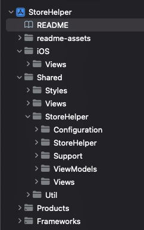

Check that your iOS and macOS targets support iOS 15 and macOS 12 respectively:

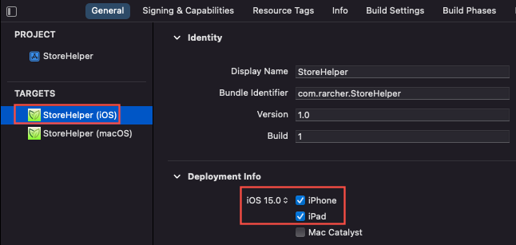
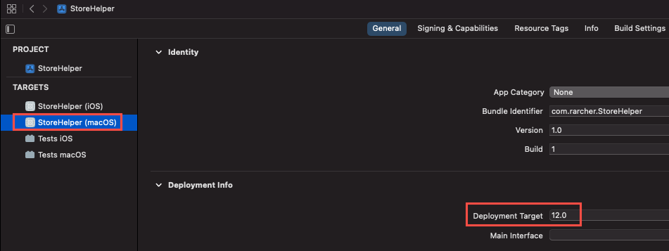

For both targets, add the **In-App Purchase** capability. This will also add the `StoreKit` framework to your project:

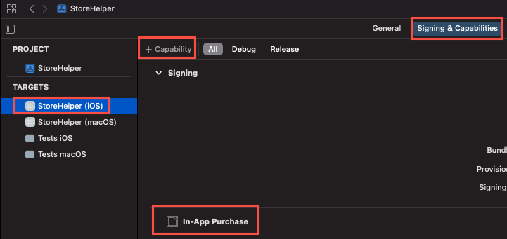

# Defining our Products
Before we do anything else we need to define the products we'll be selling. Ultimately this will be done in App Store Connect. However, testing in-app purchases (IAPs) using an **App Store Sandbox** environment takes quite a bit of setting up and is rather frustrating to work with. 

> The sandbox test environment requires you to create multiple **sandbox test accounts** in App Store Connect. Each sandbox account has to have a unique email address and be validated as an AppleID. In addition, tests must be on a real device, not the simulator.
> 
> On the test device you need to sign out of your normal AppleID and sign-in using the sandbox account. This really means you need a spare device to do testing on. To make things more painful, each time you make a purchase using a sandbox account that account becomes “used up” and can’t be used to re-purchase the same product. There’s no way to clear purchases, so you need to use a fresh sandbox account for each set of product purchases.

Fortunately, there's now a much better way.

Introduced in Xcode 12 a new **local** StoreKit test environment allows you to do early testing of IAPs in the simulator without having to set anything up in App Store Connect. You define your products locally in a **StoreKit Configuration** file. Furthermore, you can view and delete transactions, issue refunds, and a whole lot more. There’s also a new `StoreKitTest` framework that enables you to do automated testing of IAPs which we'll use later on. We'll use this approach to test IAPs in our app.

# Create the StoreKit configuration file
Select **File > New > File** and choose the **StoreKit Configuration File** template:

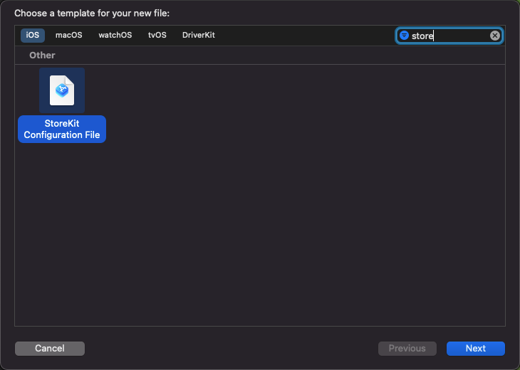

Save the file as `Products.storekit` in the `Shared/Configuration` folder.

Open the Products configuration file and click **+** to add an in-app purchase. For example, select the **Add Non-Consumable In-App Purchase** option:


You can now define your products in the StoreKit configuration file. For now we'll create four non-consumable products:

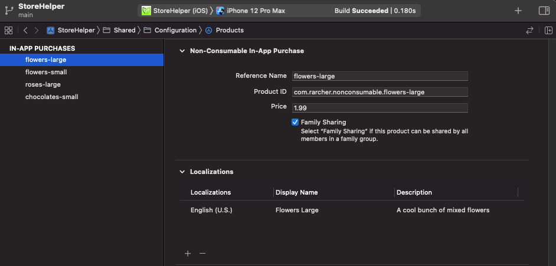

```xml
Type			: NonConsumable
ReferenceName 		: flowers-large
ProductID 		: com.rarcher.nonconsumable.flowers-large
Price 			: 1.99
FamilyShareable 	: true
Locale 			: en_US
DisplayName 		: Flowers Large
Description 		: A cool bunch of mixed flowers

Type			: NonConsumable
ReferenceName 		: flowers-small
ProductID 		: com.rarcher.nonconsumable.flowers-small
Price 			: 0.99
FamilyShareable 	: false
Locale 			: en_US
DisplayName 		: Flowers Small
Description 		: A cool small bunch of flowers

Type			: NonConsumable
ReferenceName 		: roses-large
ProductID 		: com.rarcher.nonconsumable.roses-large
Price 			: 2.99
FamilyShareable 	: false
Locale 			: en_US
DisplayName 		: Roses Large
Description 		: A large bunch of red roses

Type			: NonConsumable
ReferenceName 		: chocolates-small
ProductID 		: com.rarcher.nonconsumable.chocolates-small
Price 			: 3.99
FamilyShareable 	: true
Locale 			: en_US
Description 		: A small box of chocolates
DisplayName 		: Chocolates Small
```

- **Type**
The type of product (Non-Consumable, Consumable, Non-Renewing, Auto-Renewing).

- **Reference Name** 
A short descriptive reference for the product. Not visible to users.

- **Product ID** 
The unique code used to identify an IAP product. This same ID will be used in App Store Connect when setting up in-app purchases for production. Note that Product ID is a string that, by convention, uses the format “com.developer.product”, although it can be anything you like. Not visible to users.

- **Price** 
A hard-coded price for the product. In production your app will request localized price (and other) information from the App Store. Visible to users.

- **Family Shareable**
True if purchases can be shared by family members, false otherwise. Visible to users.

- **Locale**
By default, the first localization is for the US store. This is used if no other localizations are defined. You can add as many localizations as required. Visible to users.

- **Description**
A short description of the product. Visible to users.

- **Display Name**
The name for the product that users see.

> Note that none of the data defined in the .storekit file is ever uploaded to App Store Connect. It’s only used when testing in-app purchases locally in Xcode.

# Enable StoreKit Testing via the Project Scheme
You now need to enable StoreKit testing in Xcode (it’s disabled by default).

Select **Product > Scheme > Edit Scheme**. Now select **Run** and the **Options** tab. You can now select your configuration file from the **StoreKit Configuration** list:

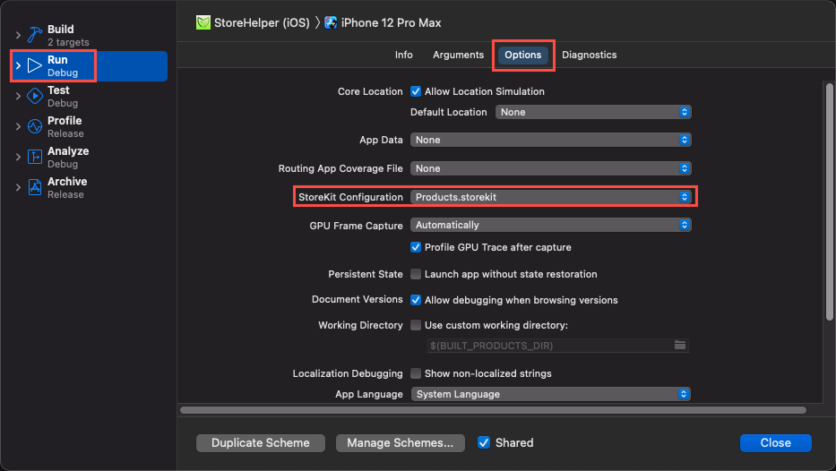

You'll need to do this for both targets (iOS and macOS).

Should you wish to disable StoreKit testing then repeat the above steps and remove the StoreKit configuration file from the **StoreKit Configuration** list.

# Creating a Production Product List
We'll see shortly how one of the first things our app has to do on starting is request localized product information from the App Store (this is the case both when using the local StoreKit test environment and the App Store release environment). This requires a list of our product identifiers. We've defined our products in the StoreKit configuration file, so it seems obvious that we should use that as the repository for our IAP data. Retrieving config data at runtime isn't difficult (it's `JSON`). However, the StoreKit configuration file is intended for use *when testing* and it's not a good idea to use it for production too. It would be all too easy to allow "test products" to make it into the release build!

So, we'll define a plain list of our product identifiers in a property list.

Create a new property list named "**Products.plist**", save it to the `Shared/Configuration` folder and add the product identifiers:

```xml
<plist version="1.0">
<dict>
    <key>Products</key>
    <array>
        <string>com.rarcher.nonconsumable.flowers-large</string>
        <string>com.rarcher.nonconsumable.flowers-small</string>
        <string>com.rarcher.nonconsumable.roses-large</string>
        <string>com.rarcher.nonconsumable.chocolates-small</string>
    </array>
</dict>
</plist>
```

To help us read the property list we'll create a `Configuration` struct with a single `public static` method. Save the `Configuration.swift` file in the `Shared/Configuration` folder:

```swift
import Foundation

/// Provides static methods for reading plist configuration files.
public struct Configuration {
    
    private init() {}
    
    /// Read the contents of the product definition property list.
    /// - Returns: Returns a set of ProductId if the list was read, nil otherwise.
    public static func readConfigFile() -> Set<ProductId>? {
        
        guard let result = Configuration.readPropertyFile(filename: StoreConstants.ConfigFile) else {
            StoreLog.event(.configurationNotFound)
            StoreLog.event(.configurationFailure)
            return nil
        }
        
        guard result.count > 0 else {
            StoreLog.event(.configurationEmpty)
            StoreLog.event(.configurationFailure)
            return nil
        }
        
        guard let values = result[StoreConstants.ConfigFile] as? [String] else {
            StoreLog.event(.configurationEmpty)
            StoreLog.event(.configurationFailure)
            return nil
        }
        
        StoreLog.event(.configurationSuccess)

        return Set<ProductId>(values.compactMap { $0 })
    }
    
    /// Read a plist property file and return a dictionary of values
    private static func readPropertyFile(filename: String) -> [String : AnyObject]? {
        
        if let path = Bundle.main.path(forResource: filename, ofType: "plist") {
            if let contents = NSDictionary(contentsOfFile: path) as? [String : AnyObject] {
                return contents
            }
        }
        
        return nil  // [:]
    }
}
```

# Logging
While researching and testing `StoreKit2` I found it really helpful to see informational messages about what's going. Rather than use `print()` statements I created a simple logging struct that would work for both debug and release builds.

```swift
//
//  StoreLog.swift
//  StoreHelper
//
//  Created by Russell Archer on 16/06/2021.
//

import Foundation
import os.log

/// We use Apple's unified logging system to log errors, notifications and general messages.
/// This system works on simulators and real devices for both debug and release builds.
/// You can view the logs in the Console app by selecting the test device in the left console pane.
/// If running on the simulator, select the machine the simulator is running on. Type your app's
/// bundle identifier into the search field and then narrow the results by selecting "SUBSYSTEM"
/// from the search field's filter. Logs also appear in Xcode's console in the same manner as
/// print statements.
///
/// When running the app on a real device that's not attached to the Xcode debugger,
/// dynamic strings (i.e. the error, event or message parameter you send to the event() function)
/// will not be publicly viewable. They're automatically redacted with the word "private" in the
/// console. This prevents the accidental logging of potentially sensistive user data. Because
/// we know in advance that StoreNotificaton enums do NOT contain sensitive information, we let the
/// unified logging system know it's OK to log these strings through the use of the "%{public}s"
/// keyword. However, we don't know what the event(message:) function will be used to display,
/// so its logs will be redacted.
public struct StoreLog {
    private static let storeLog = OSLog(subsystem: Bundle.main.bundleIdentifier!, category: "STORE")
    
    /// Logs a StoreNotification. Note that the text (shortDescription) of the log entry will be
    /// publically available in the Console app.
    /// - Parameter event: A StoreNotification.
    public static func event(_ event: StoreNotification) {
        #if DEBUG
        print(event.shortDescription())
        #else
        os_log("%{public}s", log: storeLog, type: .default, event.shortDescription())
        #endif
    }
    
    /// Logs an StoreNotification. Note that the text (shortDescription) and the productId for the
    /// log entry will be publically available in the Console app.
    /// - Parameters:
    ///   - event:      A StoreNotification.
    ///   - productId:  A ProductId associated with the event.
    public static func event(_ event: StoreNotification, productId: ProductId) {
        #if DEBUG
        print("\(event.shortDescription()) for product \(productId)")
        #else
        os_log("%{public}s for product %{public}s", log: storeLog, type: .default, event.shortDescription(), productId)
        #endif
    }
    
    /// Logs a message.
    /// - Parameter message: The message to log.
    public static func event(_ message: String) {
        #if DEBUG
        print(message)
        #else
        os_log("%s", log: storeLog, type: .info, message)
        #endif
    }
}
```

# StoreHelper
So that we have some products to display, we'll create a minimal version of the `StoreHelper` class before we focus on the UI. Save the `StoreHelper.swift` file in `Shared/StoreHelper`:

```swift
//
//  StoreHelper.swift
//  StoreHelper
//
//  Created by Russell Archer on 16/06/2021.
//

import StoreKit

public typealias ProductId = String

/// StoreHelper encapsulates StoreKit2 in-app purchase functionality and makes it easy to work with the App Store.
@available(iOS 15.0, macOS 12.0, tvOS 15.0, watchOS 8.0, *)
class StoreHelper: ObservableObject {
    
    /// List of `Product` retrieved from the App Store and available for purchase.
    @Published private(set) var products: [Product]?
    
    /// True if we have a list of `Product` returned to us by the App Store.
    public var hasProducts: Bool {
        guard products != nil else { return false }
        return products!.count > 0 ? true : false
    }
    
    /// StoreHelper enables support for working with in-app purchases and StoreKit2 using the async/await pattern.
    init() {
        
        // Read our list of product ids
        if let productIds = Configuration.readConfigFile() {
            
            // Get localized product info from the App Store
            StoreLog.event(.requestProductsStarted)
            Task.init {
                
                products = await requestProductsFromAppStore(productIds: productIds)
                
                if products == nil, products?.count == 0 { StoreLog.event(.requestProductsFailure) } else {
                    StoreLog.event(.requestProductsSuccess)
                }
            }
        }
    }
    
    /// Request localized product info from the App Store for a set of ProductId.
    ///
    /// This method runs on the main thread because it will result in updates to the UI.
    /// - Parameter productIds: The product ids that you want localized information for.
    /// - Returns: Returns an array of `Product`, or nil if no product information is
    /// returned by the App Store.
    @MainActor public func requestProductsFromAppStore(productIds: Set<ProductId>) async -> [Product]? {
        
        try? await Product.products(for: productIds)
    }
}
```

Notice how the initializer reads the products property list to get a set of `ProductId` and then asynchronously calls `requestProductsFromAppStore(productIds:)`, which in turn calls the `StoreKit2` `Product.products(for:)` method.

We also have a `@Published` array of `Product`. This array gets updated during the StoreHelper initializer:

```swift
// Get localized product info from the App Store
Task.init { 
	products = await requestProductsFromAppStore(productIds: productIds) 
}
```

The array of products is marked as `@Published` so we can use it to cause our UI to be updated when the array changes.

We can now create a minimal UI that uses `StoreHelper` to request products and then displays them in a `List`.

# Displaying Products
First, we'll add some images for our products to the asset catalog. They're named with the same unique product ids we defined in the `Products.storekit` and `Products.plist` files:

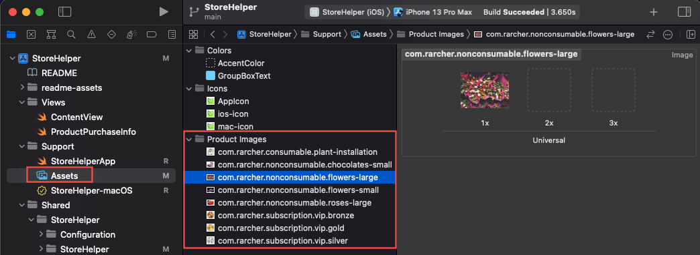

Here's our first attempt at a UI to display our products:

```swift
import SwiftUI

struct ContentView: View {
    
    @StateObject var storeHelper = StoreHelper()
    
    var body: some View {
        
        if storeHelper.hasProducts {
            List(storeHelper.products!) { product in
                HStack {
                    Image(product.id)
                        .resizable()
                        .frame(width: 75, height: 75)
                        .aspectRatio(contentMode: .fit)
                        .cornerRadius(25)
                    
                    Text(product.displayName)
                        .font(.title2)
                        .padding()
                    
                    Spacer()
                    
                    Text(product.displayPrice)
                        .font(.title2)
                        .foregroundColor(.blue)
                        .padding()
                }
                .padding()
            }
            .listStyle(.inset)
            
        } else {
            Text("No products")
                .font(.title)
                .foregroundColor(.red)
        }
    }
}

struct ContentView_Previews: PreviewProvider {
    static var previews: some View {
        ContentView()
    }
}
```

We create our `StoreHelper` as a `@StateObject` and check if `storeHelper.hasProducts`. When it does we enumerate `storeHelper.products` in a `List`. 

Running the app's iOS target produces:


And the logging output in the console looks like this:

```text
Configuration success
Request products from the App Store started
Request products from the App Store success
```

Let's be clear about what happens when the app starts:

- Our `StoreHelper` provides `StoreKit2` with a list of product ids and asks it to get *localized* product information (notice that prices are in US dollars) for us asynchronously from the App Store
- The App Store returns the requested product info as a `[Product]` and `StoreHelper` saves this in its `@Published` `products` array
- Because our `ContentView` holds `StoreHelper` as a `@StateObject`, when `StoreHelper.products` is updated this causes `ContentView` to be re-rendered and display the product list

The above process works in *exactly* the same way when the app is running in a live production environment and accessing the "real" App Store.

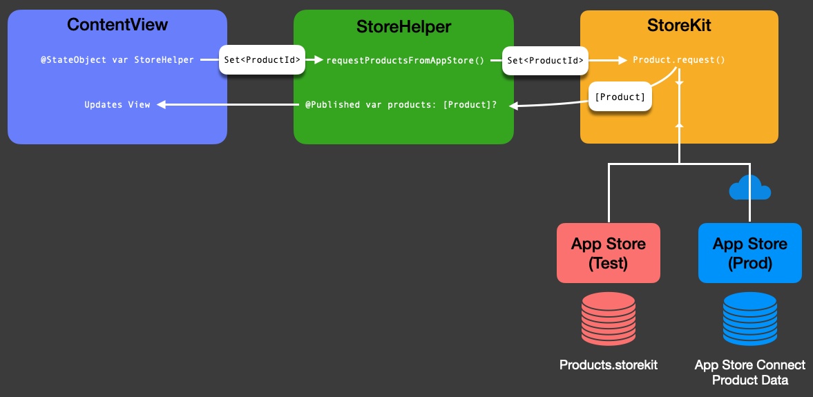

I mentioned above that prices were in US dollars. This is because, by default in test environment, the App Store `Storefront` is **United States (USD)** and the localization is **English (US)**. To support testing other locales you can change this. Make sure the `Products.storekit` file is open, then select **Editor > Default Storefront** and change this to another value. You can also changed the localization from **English (US**) with **Editor > Default Localization**.

Here I selected **United Kingdom (GBP)** as the storefront and **English (UK)** as the localization. Notice how prices are now in UK Pounds:

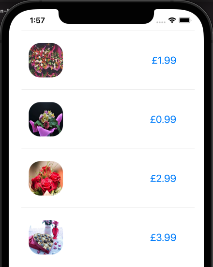

In the above screenshot you'll see that, unlike with the US storefront, the UK storefront isn't displaying the product's name. If you look at the `Product.storekit` file you'll see that the reason is because I haven't added localizations for the UK.

# The Product type
The `Product` struct is a an important object in `StoreKit2`. We've seen how the `static` `Product.products(for:)` method is used to request product information from the App Store. It's also used for several other key operations:


# Purchasing Products
## Designing the UI
Let's add the ability to purchase products. This means calling the `purchase()` method on the `Product` object that represents the product we want to purchase.

Our `ContentView` already has a list of products that it's enumerating in a `List`. So, essentially all we need to is add a `Button` and call the product's `purchase(_:)` method:

```swift
List(storeHelper.products!) { product in
	:
	Button(action: {
 		Task.init { let result = try? await product.purchase() }
 	}) {
		Text("Purchase")
 	}	
}
```

Notice how we need to add an `Task.init {...}` block to our button's action closure. This allows us to run async code in a "synchronous context" (the `ContentView`).

To keep the size and complexity of views manageable, I split the various parts of the UI into separate views like this:

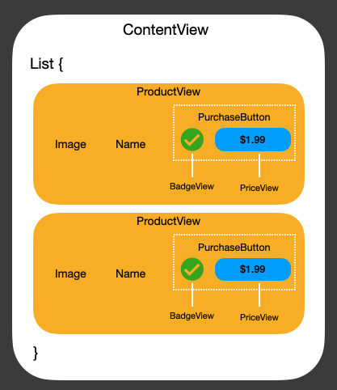

- The `ContentView` has a `List` which contains a collection of `ProductView` objects
- Each `ProductView` has an image of the product, the name of the product and a `PurchaseButton` 
- `PurchaseButton` contains a `BadgeView` and a `PriceView`
- `BadgeView` displays a small image showing the state of the purchase state of the product (i.e. purchased, failed, etc.)
- `PriceView` shows the localized price of the product as part of a purchase `Button`. When a product has been purchased the button is not displayed

## Adding support to StoreHelper
We now need to add support for purchasing to `StoreHelper`. The main things to add are:

- A `@Published` `Set` of `ProductId` that holds the ids of purchased products:

```swift
@Published private(set) var purchasedProducts = Set<ProductId>()
```

- A variable that holds the current state of purchasing:

```swift
public enum PurchaseState { case notStarted, inProgress, complete, pending, cancelled, failed, failedVerification, unknown }
public private(set) var purchaseState: PurchaseState = .notStarted
```

- A `purchase(_:)` method (rather than call it directly from the UI, I moved the call to StoreKit's `product.purchase()` method into `StoreHelper`):

```swift
public func purchase(_ product: Product) async throws -> (transaction: Transaction?, purchaseState: PurchaseState)  { ... }
```

- A **task handle** and associated method that enables us to listen for App Store transactions. These transactions are things like resolution of "ask-to-buy" (pending) purchases, refunds, restoring purchases, etc.:

```swift
/// Handle for App Store transactions.
internal var transactionListener: Task<Void, Error>? = nil
:
init() {
    transactionListener = handleTransactions()
	:
}
:
internal func handleTransactions() -> Task<Void, Error> { ... }
```

Here's the code for `StoreHelper`. For brevity, all comments and logging statements have been removed. 
You can [browse the full code for `StoreHelper` here on GitHub](https://github.com/russell-archer/StoreHelper/blob/main/Shared/StoreHelper/StoreHelper.swift).

```swift
import StoreKit

public typealias ProductId = String

@available(iOS 15.0, macOS 12.0, tvOS 15.0, watchOS 8.0, *)
public class StoreHelper: ObservableObject {
    @Published private(set) var products: [Product]?
    @Published private(set) var purchasedProducts = Set<ProductId>()
    public private(set) var purchaseState: PurchaseState = .notStarted
    public enum PurchaseState { case notStarted, inProgress, complete, pending, cancelled, failed, failedVerification, unknown }
    internal var transactionListener: Task<Void, Error>? = nil
    
    init() {
        transactionListener = handleTransactions()
        if let productIds = Configuration.readConfigFile() {
            Task.init {
                products = await requestProductsFromAppStore(productIds: productIds)    
                if products == nil, products?.count == 0 { StoreLog.event(.requestProductsFailure) } 
            }
        }
    }

    @MainActor public func requestProductsFromAppStore(productIds: Set<ProductId>) async -> [Product]? {
        try? await Product.products(for: productIds)
    }
    
    public func isPurchased(product: Product) async throws -> Bool {
        guard let mostRecentTransaction = await product.latestTransaction else { return false }
        
        let checkResult = checkTransactionVerificationResult(result: mostRecentTransaction)
        if !checkResult.verified { throw StoreException.transactionVerificationFailed }

        let validatedTransaction = checkResult.transaction
        await updatePurchasedIdentifiers(validatedTransaction)

        return validatedTransaction.revocationDate == nil && !validatedTransaction.isUpgraded
    }
    
    public func purchase(_ product: Product) async throws -> (transaction: Transaction?, purchaseState: PurchaseState)  {
        guard purchaseState != .inProgress else { throw StoreException.purchaseInProgressException }
        
        purchaseState = .inProgress
        guard let result = try? await product.purchase() else {
            purchaseState = .failed
            throw StoreException.purchaseException
        }

        switch result {
            case .success(let verificationResult):
                let checkResult = checkTransactionVerificationResult(result: verificationResult)
                if !checkResult.verified {
                    purchaseState = .failedVerification
                    throw StoreException.transactionVerificationFailed
                }
                
                let validatedTransaction = checkResult.transaction
                await updatePurchasedIdentifiers(validatedTransaction)
                await validatedTransaction.finish()
                purchaseState = .complete
                return (transaction: validatedTransaction, purchaseState: .complete)
                
            case .userCancelled:
                purchaseState = .cancelled
                return (transaction: nil, .cancelled)
                
            case .pending:
                purchaseState = .pending
                return (transaction: nil, .pending)
                
            default:
                purchaseState = .unknown
                return (transaction: nil, .unknown)
        }
    }
    
    public func product(from productId: ProductId) -> Product? {
        guard products != nil else { return nil }
        let matchingProduct = products!.filter { product in 
			product.id == productId
        }
        
        guard matchingProduct.count == 1 else { return nil }
        return matchingProduct.first
    }
    
    internal func handleTransactions() -> Task<Void, Error> {
        return Task.detached {
            for await verificationResult in Transaction.listener {
                let checkResult = self.checkTransactionVerificationResult(result: verificationResult)

                if checkResult.verified {
                    let validatedTransaction = checkResult.transaction
                    await self.updatePurchasedIdentifiers(validatedTransaction)
                    await validatedTransaction.finish()
                    
                }
            }
        }
    }

    @MainActor internal func updatePurchasedIdentifiers(_ transaction: Transaction) async {
        if transaction.revocationDate == nil { purchasedProducts.insert(transaction.productID) } 
		else { purchasedProducts.remove(transaction.productID) }
    }
    
    internal func checkTransactionVerificationResult(result: VerificationResult<Transaction>) -> (transaction: Transaction, verified: Bool) {
        switch result {
            case .unverified(let unverifiedTransaction): return (transaction: unverifiedTransaction, verified: false) 
            case .verified(let verifiedTransaction): return (transaction: verifiedTransaction, verified: true)
        }
    }
}
```

We also need to add a **ViewModel** for `PriceView` named `PriceViewModel`:

```swift
import StoreKit
import SwiftUI

struct PriceViewModel {
    @ObservedObject var storeHelper: StoreHelper
    @Binding var purchasing: Bool
    @Binding var cancelled: Bool
    @Binding var pending: Bool
    @Binding var failed: Bool
    @Binding var purchased: Bool
    
    func purchase(product: Product) async {
        do {
            let purchaseResult = try await storeHelper.purchase(product)
            if purchaseResult.transaction != nil { updatePurchaseState(newState: purchaseResult.purchaseState) } 
			else { updatePurchaseState(newState: purchaseResult.purchaseState)  // The user cancelled, or it's pending approval }
        } catch {            
            updatePurchaseState(newState: .failed)  // The purchase or validation failed
        }
    }
    
    private func updatePurchaseState(newState: StoreHelper.PurchaseState) {
        purchasing  = false
        cancelled   = newState == .cancelled
        pending     = newState == .pending
        failed      = newState == .failed
        purchased   = newState == .complete
    }
}
```

# Validating Transactions
A key point to note is how we **validate** transactions. Every time our app receives a transaction (e.g. when a purchase is made) from the App Store via `StoreKit`, the transaction has **already passed through a verification process** to confirm whether the transaction is signed by the App Store for **this app** for **this device**. 

> That is, `Storekit2` does **automatic** transaction ("receipt") verification for you. So, no more using OpenSSL to decrypt and read App Store receipts or sending receipts to an Apple server for verification! 
> 
> Note that the App Store cryptographically secures and signs each transaction using the industry-standard JSON Web Signature (`JWS`) format.  
> 
> The `Transaction` object provides access to the underling JWS as a `String` property, so you may perform your own validation if required (although this probably won't be necessary for most apps).
        
In our `StoreHelper.purchase(_:)` method, we call StoreKit's `product.purchase()` method and get a `PurchaseResult` back that indicates `success`, `userCancelled`, or `pending`. The call to `product.purchase()` may also throw an exception, which indicates that the purchase failed.

If the purchase seems to have succeeded (`PurchaseResult == .success`), `StoreKit2` has already automatically attempted to validate the transaction, returning the result of this validation wrapped in a `VerificationResult`.

We check the `VerificationResult<Transaction>` to see if the transaction passed or failed the verification process. This is equivalent to receipt validation in `StoreKit1`. 

If the verification process is a success we update our collection of purchased product ids and give the user access to the purchased product.

The simplified purchase process flow (showing mainly the "success" path) is as follows:

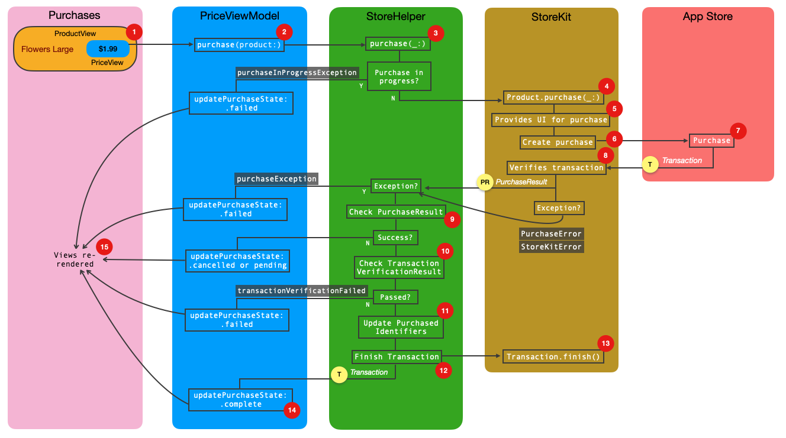

1. The user taps the `PriceView` button, which calls `PriceViewModel.purchase(product:)`, passing the `Product` to purchase

2. `PriceViewModel` calls `purchase(_:)` in `StoreHelper`, passing the `Product` to purchase
3. If there's already a purchase in progress, then a `StoreException.purchaseInProgressException` is thrown and caught by `PriceViewModel`
4. `StoreHelper` asynchronously calls `StoreKit.purchase(_:)` and awaits the result
5. `StoreKit2` leads the user through the purchase process and provides all the UI required
6. `StoreKit2` talks to the App Store to complete the purchase
7. The App Store completes the purchase and sends `StoreKit2` a purchase `Transaction` object
8. `StoreKit2` verifies that the purchase `Transaction` is correctly signed by the App Store and that the purchase is valid for the current user on the particular device in use. A `Product.PurchaseResult` is returned to `StoreHelper`. 
	- If `StoreKit2` encounters an error then a `StoreKitError` exception is thrown
	- If App Store encounters an error then a `PurchaseError`  exception is thrown
	- Any exceptions are caught by `StoreHelper`, which re-throws a `StoreException.purchaseException`. This will be caught by `PriceViewModel`
9. `StoreHelper` checks the `Product.PurchaseResult` returned by `StoreKit2`, if it's a success it...
10. ...checks the `VerificationResult` (which is wrapped up in the `PurchaseResult`). If this results in a valid `Transaction` then...
11. ... the collection of purchase product ids is updated to add the newly purchased product
12. `StoreHelper` tells `StoreKit2` the `Transaction` is finished and returns the `Transaction` object to `PriceViewModel`. It sets `@State` variables to show the purchase was a success and the UI is re-rendered

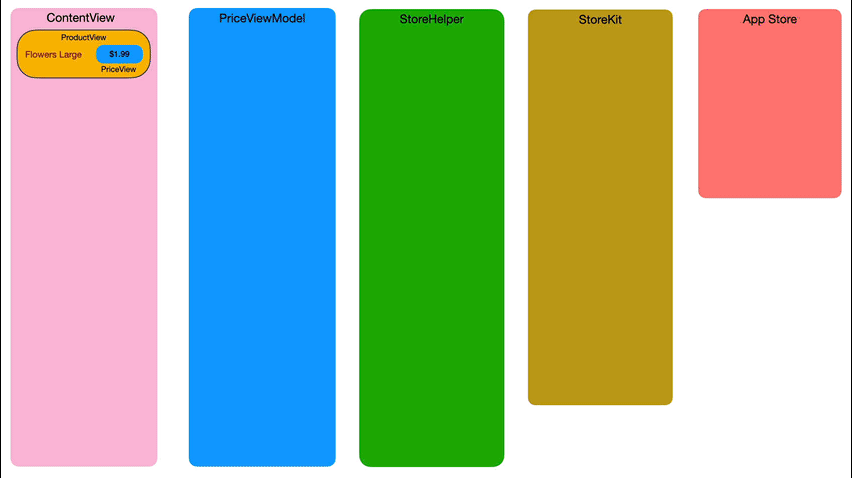

If we run the app we can now make purchases:

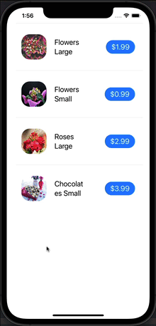

# Ask-to-buy support
The App Store supports the concept of "ask-to-buy" purchases, where parents can configure an Apple ID to require their permission to make a purchases. 
When a user makes this type of purchase the `PurchaseResult` returned by StoreKit's `product.purchase()` method will have a value of `.pending`. This
state can also be applicable when a user is required to make banking changes before a purchase is confirmed.

With `StoreKit` testing (which works with both `StoreKit` and `StoreKit2`) we can easily simulate pending purchases to see if our app correctly supports them.

To enable ask-to-buy support in `StoreKit` select the `.storekit` configuration file and then select **Editor > Enable Ask To Buy**:

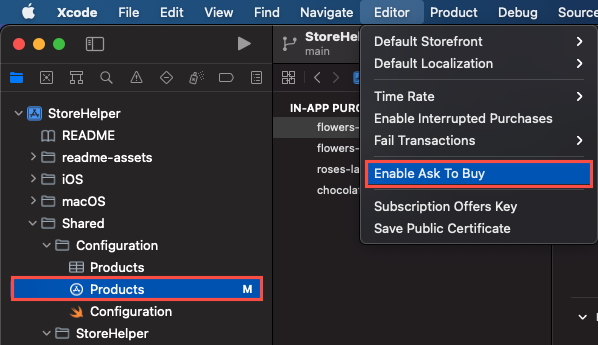

Now run the app and attempt to make a purchase. You'll find that the purchase proceeds as normal. 
However, instead of receiving a purchase confirmation you'll see an **Ask Permission** alert. 

Tap **Ask** and you'll see that the purchase enters a `.pending` state, as denoted by the orange hourglass next to the product purchase button:

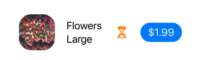

With the app still running, click the **Manage StoreKit Transaction** button on the Xcode debug area pane:


You'll now be able to see the transaction that is "Pending Approval":


Right-click the transaction that is pending approval and select **Approve Transaction**:

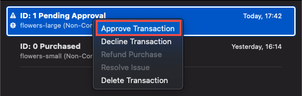

You should see the purchase confirmed as `StoreHelper` processes the transaction:


# What Products has the user purchased?
Everything seems to be working well. However, what happens if we quit and restart the app. How do we know what purchases the user has previously made?

If you stop and re-run the app you'll see that without any work on our part it seems to remember what's been purchased. This is because the UI calls `StoreHelper.isPurchased(product:)` for each product when it's displayed. This checks the `StoreKit2` `Transaction.currentEntitlement(for:)` property to get a list of transactions for the user. This includes non-consumable in-app purchases and active subscriptions.

But hang on a minute, isn't there a potential problem here? Doesn't `StoreKit2` have to check with the App Store to confirm a user's transactions and entitlements? What happens when the network is unavailable and the App Store can't be reached? In that case, do we need to have some kind of "backup" collection of purchases (product ids) that gets persisted and can be used when the App Store's not available?

# Use the Receipt, Luke
Happily, we don't need a backup collection of purchased product ids because we can always refer to the single source of truth: the **receipt** issued by the App Store, which is stored *on the device* in the app's **main bundle**. The receipt contains a complete record of a user's in-app purchase history for that app.

When an app is installed (or re-installed) the App Store issues a receipt at the same time which *includes any previous transactions*. That is, purchases made by the user previously on the same device, or purchases made on another device belonging to the same user (i.e. using the same Apple ID). 

This is a change from how things worked previously with `StoreKit1` where, in order to sync with the App Store and receive an up-to-date receipt, the user would have to "restore" previous purchases. With `StoreKit2`, users don't need to restore previous transactions when your app is installed/reinstalled. 

- `StoreKit1` 
	- The receipt is a **signed** and **encrypted file**
	- Stored in the app's main bundle
	- The location of the receipt is given by `Bundle.main.appStoreReceiptURL`
	- See https://github.com/russell-archer/IAPHelper for details on reading and validating the receipt with `StoreKit1`

- `StoreKit2`
	- The receipt is a **SQLite database** (`receipts.db`)
	- Contains all of the user's transactions, with one row per transaction

So, just out of interest, where is the receipt database and can we look at its contents?!

Unless you jailbreak your iPhone you can't view the receipts database on a real device. However, when using the simulator you **can** directly view the contents of the database. The easiest way to find the path to the database is to add the following print statement somewhere in your app:

```swift
print("StoreKit1 receipt is here: \(Bundle.main.appStoreReceiptURL!)")
```

This gives you URL of the `StoreKit1` receipt. It will be something like:

```bash
/Users/rarcher/Library/Developer/CoreSimulator/Devices/{device-id}/data/Containers/Data/Application/{app-id}/StoreKit/receipt
```

The `receipt` directory will contain the old-style `StoreKit1` encrypted receipt. 

If you navigate to `...{app-id}/Library/Caches/StoreKit` you should see the `StoreKit2` receipts database:


If you have a SQLite client installed (I used **SQLPro for SQLite**) you can open the database. Here's what it looks like having made two purchases:


We can immediately see how each transaction is structured, with the `product_id` column showing the `ProductId` of the purchase. 
The `receipt` column is a plain text field where the contents are clearly encrypted:


So, because we know an up-to-date version of the receipts database will always be present, we can always use it (via `StoreKit2`) to find out a user's product entitlements.

# Consumables
Now we have the basics of the app working we can move onto adding another type of product: consumables.

Consumables are products that are used once, or for a limited time and then expire. If the user wants to use the product again they need to re-purchase. A typical consumable product would be a token in game that temporarily gives you more lives or higher powers. Once the token's used up the user would lose the abilities it confers.

We'll add a consumable called "VIP plant installation service". It last for one appointment and then expires.

Open the `Products.storekit` file and click the **+** at the bottom-left of the window to add a consumable:

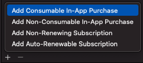

We define the product like this:


Now add the new product to Products.plist:

```xml
<?xml version="1.0" encoding="UTF-8"?>
<!DOCTYPE plist PUBLIC "-//Apple//DTD PLIST 1.0//EN" "http://www.apple.com/DTDs/PropertyList-1.0.dtd">
<plist version="1.0">
<dict>
    <key>Products</key>
    <array>
        <string>com.rarcher.nonconsumable.flowers-large</string>
        <string>com.rarcher.nonconsumable.flowers-small</string>
        <string>com.rarcher.nonconsumable.roses-large</string>
        <string>com.rarcher.nonconsumable.chocolates-small</string>
        <string>com.rarcher.consumable.plant-installation</string>
    </array>
</dict>
</plist>
```

Next, add an image for the new product to the asset catalog:

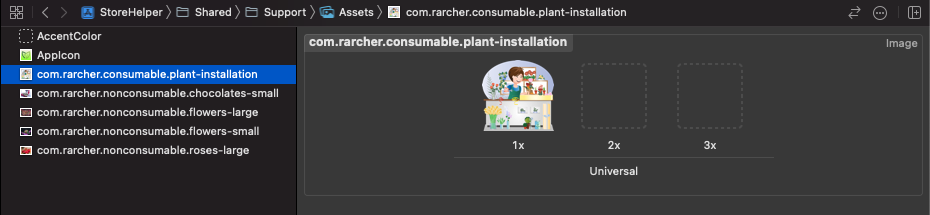

Running the app shows the new product:

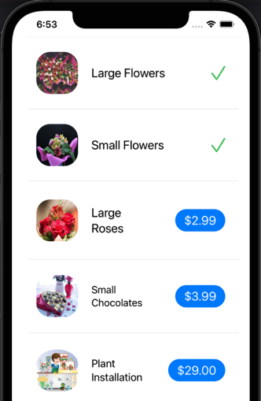

Everything seems to work. However, we're not distinguishing between consumable and non-consumable products either visually or in our code.

First, let's update `StoreHelper` by adding two new computed properties `consumableProducts` and `nonConsumableProducts`:

```swift
public class StoreHelper: ObservableObject {
    
    /// Array of `Product` retrieved from the App Store and available for purchase.
    @Published private(set) var products: [Product]?
    
    /// Computed property that returns all the consumable products in the `products` array.
    public var consumableProducts: [Product]? {
        guard products != nil else { return nil }
        return products!.filter { product in product.type == .consumable }
    }
    
    /// Computed property that returns all the non-consumable products in the `products` array.
    public var nonConsumableProducts: [Product]? {
        guard products != nil else { return nil }
        return products!.filter { product in product.type == .nonConsumable }
    }
	:
	:
```

As you can see we filter the `products` array to return only products of a specific type using `Product.type`.

Now we'll update the UI in `ContentView`:

```swift
struct ContentView: View {
    
    @StateObject var storeHelper = StoreHelper()
    
    var body: some View {
        
        if storeHelper.hasProducts {
            
            List {
                
                if let nonConsumables = storeHelper.nonConsumableProducts {
                    Section(header: Text("Everyday Luxuries")) {
                        ForEach(nonConsumables, id: \.id) { product in
                            ProductView(storeHelper: storeHelper,
                                        productId: product.id,
                                        displayName: product.displayName,
                                        price: product.displayPrice)
                        }
                    }
                }
                
                if let consumables = storeHelper.consumableProducts {
                    Section(header: Text("VIP Services")) {
                        ForEach(consumables, id: \.id) { product in
                            ProductView(storeHelper: storeHelper,
                                        productId: product.id,
                                        displayName: product.displayName,
                                        price: product.displayPrice)
                        }
                    }
                }
            }
            .listStyle(.insetGrouped)
            
        } else {
            
            Text("No products available")
                .font(.title)
                .foregroundColor(.red)
        }
    }
}
```

We create a grouped `List` and iterate through products in a `ForEach` loop. The `\.id` in the loop references the product's `ProductId`. 

Running the app produces:

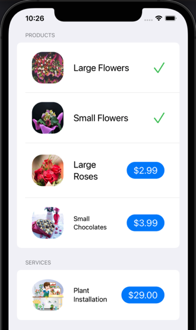

If we try to purchase the "Plant Installation" consumable product it seems to work (and the transaction succeeds). However, the price button doesn't change to a green tick. The reason for this is in the `StoreHelper.isPurchased(productId:)` method:

```swift
public func isPurchased(productId: ProductId) async throws -> Bool {
    guard let currentEntitlement = await Transaction.currentEntitlement(for: productId) else {
        return false  // There's no transaction for the product, so it hasn't been purchased
    }
    :
	:
}
```

We're checking for transactions for the consumable but none are found. How can this be?! 

The reason is simple and non-obvious:

> Transactions for consumable products ARE NOT STORED PERMANENTLY IN THE RECEIPT!

The rationale for this from Apple's perspective is that consumables are "ephemeral". To quote Apple's documentation (https://developer.apple.com/documentation/storekit/transaction/3851204-currententitlements) for `Transaction.currentEntitlement(for:)`:

> The current entitlements sequence emits the latest transaction for each product the user is currently entitled to, specifically: 
> - :
> - A transaction for each consumable in-app purchase that you have not finished by calling `finish()`

In tests I've done transactions for consumables do not remain in the receipt even if you omit to call `finish()`.

So, if you plan to sell consumable products in your own apps you'll need to create some sort of system for keeping track of them. This could be as simple as storing data in `UserDefaults`. However, for greater security use either the keychain or a database as part of your backend solution.

For the purposes of this demo we'll use a simple Keychain-based system.

Here's a helper class for that:

```swift
import Foundation
import Security

/// A consumable product id and associated count value.
///
/// Consumable product purchase transactions are considered transient by Apple and are
/// therefore not stored in the App Store receipt. `KeychainHelper` uses `ConsumableProductId`
/// to store consumable product ids in the keychain. Each time the consumable is purchased the
/// count should incremented. When a purchase is expired the count is decremented. When the count
/// reaches zero the user no longer has access to the product.
public struct ConsumableProductId: Hashable {
    let productId: ProductId
    let count: Int
}

/// KeychainHelper provides methods for working with collections of `ConsumableProductId` in the keychain.
public struct KeychainHelper {
    
    /// Add a consumable `ProductId` to the keychain and set its count value to 1.
    /// If the keychain already contains the `ProductId` its count value is incremented.
    /// - Parameter productId: The consumable `ProductId` for which the count value will be incremented.
    /// - Returns: Returns true if the purchase was added or updated, false otherwise.
    public static func purchase(_ productId: ProductId) -> Bool {
        
        if has(productId) { return update(productId, purchase: true) }
        
        // Create a query for what we want to add to the keychain
        let query: [String : Any] = [kSecClass as String  : kSecClassGenericPassword,
                                     kSecAttrAccount as String : productId,
                                     kSecValueData as String : "1".data(using: .utf8)!]
        
        // Add the item to the keychain
        let status = SecItemAdd(query as CFDictionary, nil)
        return status == errSecSuccess
    }
    
    /// Decrements the purchase count for a consumable `ProductId` in the keychain. If the count value is
    /// already zero no action is taken.
    /// - Parameter productId: The consumable `ProductId` for which the count value will be decremented.
    /// - Returns: Returns true if the product was expired (removed), false otherwise.
    public static func expire(_ productId: ProductId) -> Bool {
        update(productId, purchase: false)
    }
    
    /// Search the keychain for a consumable `ProductId`.
    /// - Parameter productId: The consumable `ProductId` to search for.
    /// - Returns: Returns true if the consumable `ProductId` was found in the keychain, false otherwise.
    public static func has(_ productId: ProductId) -> Bool {
        
        // Create a query of what we want to search for. Note we don't restrict the search (kSecMatchLimitAll)
        let query = [kSecClass as String : kSecClassGenericPassword,
                     kSecAttrAccount as String : productId,
                     kSecMatchLimit as String: kSecMatchLimitOne] as CFDictionary
        
        // Search for the item in the keychain
        var item: CFTypeRef?
        let status = SecItemCopyMatching(query, &item)
        return status == errSecSuccess
    }
    
    /// Get the count value associated with a consumable `ProductId`.
    /// - Parameter productId: The consumable `ProductId`.
    /// - Returns: Returns the value of the count, or 0 if not found.
    public static func count(for productId: ProductId) -> Int {
        
        // Create a query of what we want to search for.
        let query = [kSecClass as String : kSecClassGenericPassword,
                     kSecAttrAccount as String : productId,
                     kSecMatchLimit as String: kSecMatchLimitOne,
                     kSecReturnAttributes as String: true,
                     kSecReturnData as String: true] as CFDictionary
        
        var item: CFTypeRef?
        let status = SecItemCopyMatching(query, &item)
        guard status == errSecSuccess else { return 0 }
        
        // Extract the count value data
        guard let foundItem = item as? [String : Any],
              let countData = foundItem[kSecValueData as String] as? Data,
              let countValue = String(data: countData, encoding: String.Encoding.utf8)
        else { return 0 }
        
        return Int(countValue) ?? 0
    }
    
    /// Update the count value associated with the consumable `ProductId` in the keychain.
    /// If the `ProductId` doesn't exist in the keychain it's added and its value set to 1.
    /// - Parameters:
    ///   - productId: The consumable `ProductId`.
    ///   - purchase: true if the consumable product has been purchased, false if it has been expired.
    /// - Returns: Returns true if the update was successful, false otherwise.
    public static func update(_ productId: ProductId, purchase: Bool) -> Bool {
        
        if !has(productId) { return KeychainHelper.purchase(productId) }
        
        var count = count(for: productId)
        if count < 0 { count = 0 }
        
        // Create a query for what we want to change in the keychain
        let query: [String : Any] = [kSecClass as String : kSecClassGenericPassword,
                                     kSecAttrAccount as String : productId,
                                     kSecValueData as String : String(count).data(using: String.Encoding.utf8)!]
        
        // Create a query for changes we want to make
        var newCount = purchase ? count+1 : count-1
        if newCount < 0 { newCount = 0 }
        
        let changes: [String: Any] = [kSecAttrAccount as String : productId,
                                      kSecValueData as String : String(newCount).data(using: String.Encoding.utf8)!]
        
        // Update the item
        let status = SecItemUpdate(query as CFDictionary, changes as CFDictionary)
        return status == errSecSuccess
    }
    
    /// Search for all the consumable product ids for the current user that are stored in the keychain.
    /// - Parameter productIds: A set of `ProductId` that is used to match entries in the keychain to available products.
    /// - Returns: Returns a set of ConsumableProductId for all the product ids stored in the keychain.
    public static func all(productIds: Set<ProductId>) -> Set<ConsumableProductId>? {
        
        // Create a query of what we want to search for. Note we don't restrict the search (kSecMatchLimitAll)
        let query = [kSecClass as String : kSecClassGenericPassword,
                     kSecMatchLimit as String: kSecMatchLimitAll,
                     kSecReturnAttributes as String: true,
                     kSecReturnData as String: true] as CFDictionary
        
        // Search for all the items created by this app in the keychain
        var item: CFTypeRef?
        let status = SecItemCopyMatching(query, &item)
        guard status == errSecSuccess else { return nil }
        
        // The item var is an array of dictionaries
        guard let entries = item as? [[String : Any]] else { return nil }
        
        var foundProducts = Set<ConsumableProductId>()
        for entry in entries {
            if  let pid = entry[kSecAttrAccount as String] as? String,
                productIds.contains(pid),
                let data = entry[kSecValueData as String] as? Data,
                let sValue = String(data: data, encoding: String.Encoding.utf8),
                let value = Int(sValue) {
                foundProducts.insert(ConsumableProductId(productId: pid, count: value))
            }
        }
        
        return foundProducts.count > 0 ? foundProducts : nil
    }
    
    /// Delete the `ProductId` from the keychain.
    /// - Parameter productId: `ProductId` to remove.
    /// - Returns: Returns true if the `ProductId` was deleted, false otherwise.
    public static func delete(_ consumableProduct: ConsumableProductId) -> Bool {
        
        // Create a query of what we want to search for
        let query = [kSecClass as String : kSecClassGenericPassword,
                     kSecAttrAccount as String : consumableProduct.productId,
                     kSecValueData as String: String(consumableProduct.count).data(using: String.Encoding.utf8)!,
                     kSecMatchLimit as String: kSecMatchLimitOne] as CFDictionary
        
        // Search for the item in the keychain
        let status = SecItemDelete(query)
        return status == errSecSuccess
    }
}
```

We also need to make a few changes in `StoreHelper:`

```swift
/// Requests the most recent transaction for a product from the App Store and determines if it 
/// has been previously purchased.
///
/// May throw an exception of type `StoreException.transactionVerificationFailed`.
/// - Parameter productId: The `ProductId` of the product.
/// - Returns: Returns true if the product has been purchased, false otherwise.
public func isPurchased(productId: ProductId) async throws -> Bool {
    guard let product = product(from: productId) else { return false }
    
    // We need to treat consumables differently because their transaction are NOT stored 
	// in the receipt.
    if product.type == .consumable {
        await updatePurchasedIdentifiers(productId, insert: true)
        return KeychainHelper.count(for: productId) > 0
    }
	:
}
:
@MainActor private func updatePurchasedIdentifiers(_ productId: ProductId, insert: Bool) async {
    guard let product = product(from: productId) else { return }
    
    if insert {
        if product.type == .consumable {
            let count = count(for: productId)
            let products = purchasedProducts.filter({ $0 == productId })
            if count == products.count { return }
        } else {
            if purchasedProducts.contains(productId) { return }
        }
        
        purchasedProducts.append(productId)
        
    } else {
        if let index = purchasedProducts.firstIndex(where: { $0 == productId}) {
            purchasedProducts.remove(at: index)
        }
    }
}

extension StoreHelper {
    
    /// Gives the count for purchases for a consumable product. Not applicable to nonconsumables 
	/// and subscriptions.
    /// - Parameter productId: The `ProductId` of a consumable product.
    /// - Returns: The count for purchases for a consumable product (a consumable may be 
	/// purchased multiple times).
    public func count(for productId: ProductId) -> Int {
        if let product = product(from: productId) {
            if product.type != .consumable { return 0 }
            return KeychainHelper.count(for: productId)
        }
        
        return 0
    }
    
    /// Removes all `ProductId` entries in the keychain associated with consumable product purchases.
    public func resetKeychainConsumables() {
        guard products != nil else { return }
        
        let consumableProductIds = products!.filter({ $0.type == .consumable}).map({ $0.id })
        guard let cids = KeychainHelper.all(productIds: Set(consumableProductIds)) else { return }
        cids.forEach { cid in
            if KeychainHelper.delete(cid) {
                Task.init { await updatePurchasedIdentifiers(cid.productId, insert: false) }
            }
        }
    }
}

```

We also introduce a `ConsumableView` that displays a count of the number of unexpired purchases of the consumable product the user has:

```swift
import SwiftUI
import StoreKit

/// Displays a single row of product information for the main content List.
struct ConsumableView: View {
    
    // Access the storeHelper object that has been created by @StateObject in StoreHelperApp
    @EnvironmentObject var storeHelper: StoreHelper
    @State var count: Int = 0
    
    var productId: ProductId
    var displayName: String
    var price: String
    
    var body: some View {
        HStack {
            if count == 0 {
                Image(productId)
                    .resizable()
                    .frame(width: 75, height: 80)
                    .aspectRatio(contentMode: .fit)
                    .cornerRadius(25)
            } else {
                Image(productId)
                    .resizable()
                    .frame(width: 75, height: 80)
                    .aspectRatio(contentMode: .fit)
                    .cornerRadius(25)
                    .overlay(Badge(count: $count))
            }
            Text(displayName)
                .font(.title2)
                .padding()
                .lineLimit(2)
                .minimumScaleFactor(0.5)
            Spacer()
            PurchaseButton(productId: productId, price: price)
        }
        .padding()
        .onAppear {
            count = storeHelper.count(for: productId)
        }
        .onChange(of: storeHelper.purchasedProducts) { _ in
            count = storeHelper.count(for: productId)
        }
    }
}

struct Badge : View {
    @Binding var count : Int
	
    var body: some View {
        ZStack {
            Capsule()
                .fill(Color.red)
                .frame(width: 30, height: 30, alignment: .topTrailing)
                .position(CGPoint(x: 70, y: 10))
            
            Text(String(count)).foregroundColor(.white)
                .font(Font.system(size: 20).bold()).position(CGPoint(x: 70, y: 10))
        }
    }
}
```

If you purchase a consumable the app now looks like this:

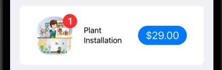

And if you purchase the product again:

![[StoreHelper Demo 44.png]]

# Subscriptions
We'll create an auto-renewable subscription (Apple discourages the use of the older non-renewing subscriptions) for a "VIP Home Plant Care Visit". The subscription offers three different levels of service: Gold, Silver and Bronze.

Open the `Products.storekit` file and click the **+** to add a new auto-renewable subscription:


The first thing you need to do is define a subscription group:

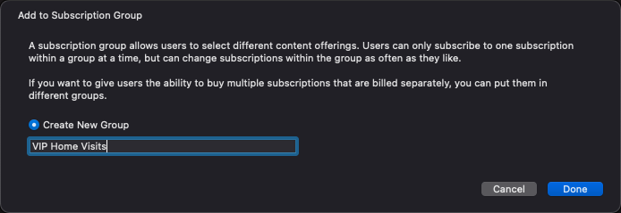

You can then define your products within the group:

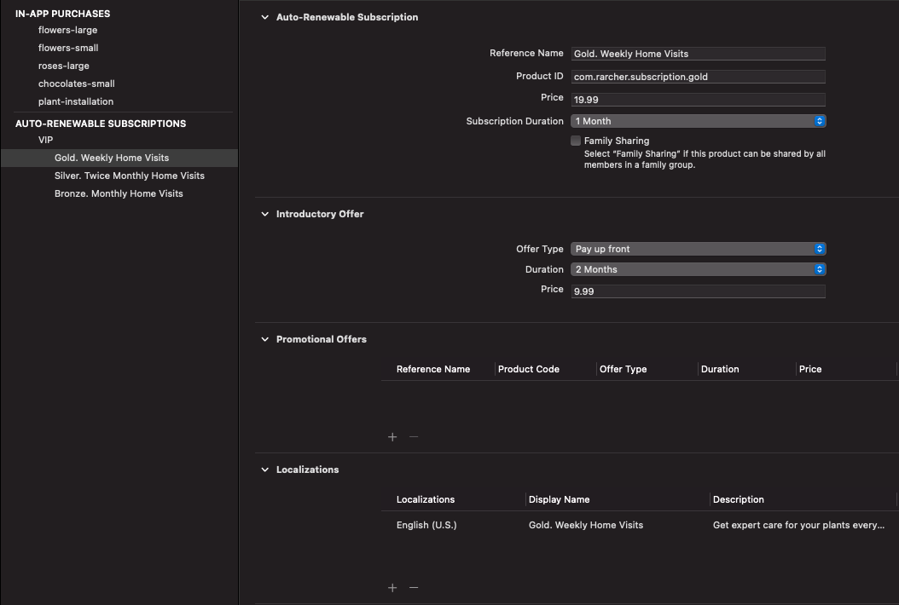

To create subsequent products, click the **+** to add a new auto-renewable subscription. You'll then be offered the choice of adding a new product within the existing group or creating a new group. Select the "VIP Home Visits" group:

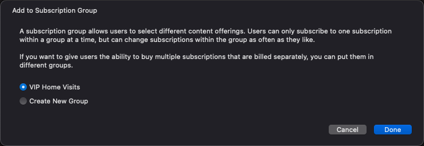

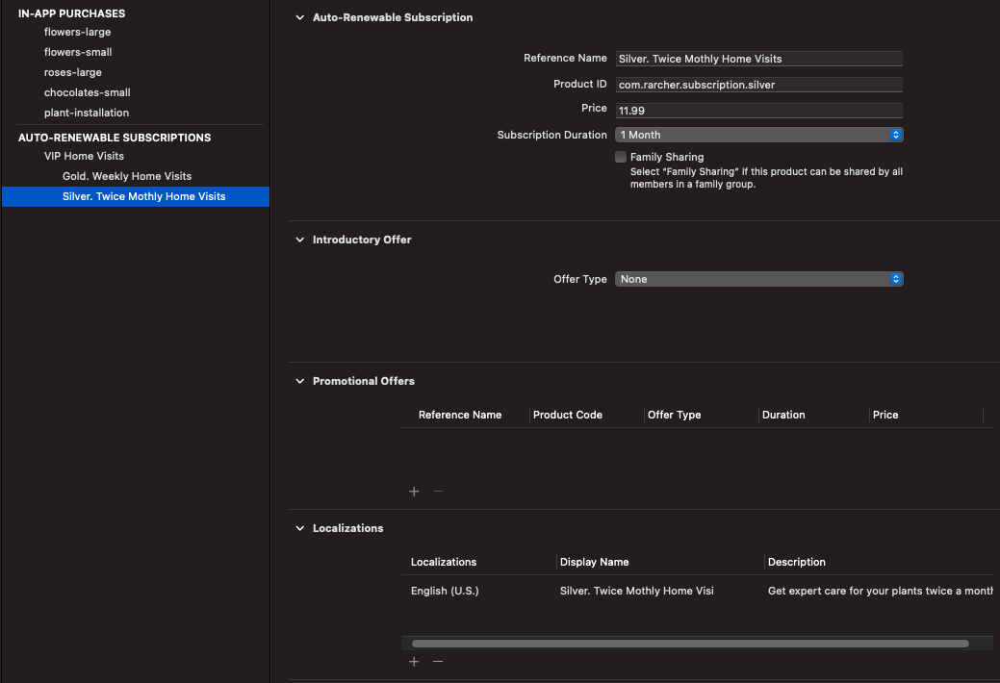

Finally, create the third subscription:

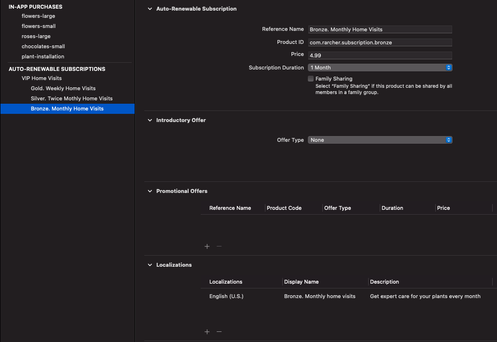

Update `Products.plist`:

```xml
<?xml version="1.0" encoding="UTF-8"?>
<!DOCTYPE plist PUBLIC "-//Apple//DTD PLIST 1.0//EN" "http://www.apple.com/DTDs/PropertyList-1.0.dtd">
<plist version="1.0">
<dict>
    <key>Products</key>
    <array>
        <string>com.rarcher.nonconsumable.flowers-large</string>
        <string>com.rarcher.nonconsumable.flowers-small</string>
        <string>com.rarcher.nonconsumable.roses-large</string>
        <string>com.rarcher.nonconsumable.chocolates-small</string>
        <string>com.rarcher.consumable.plant-installation</string>
        <string>com.rarcher.subscription.gold</string>
        <string>com.rarcher.subscription.silver</string>
        <string>com.rarcher.subscription.bronze</string>
    </array>
</dict>
</plist>
```

We can now update `StoreHelper` and `ContentView`:

```swift
/// Computed property that returns all the auto-renewing subscription products 
/// in the `products` array.
public var subscriptionProducts: [Product]? {
	guard products != nil else { return nil }
    return products!.filter { product in product.type == .autoRenewable }
}
```

```swift
struct ContentView: View {
    
    @StateObject var storeHelper = StoreHelper()
    var body: some View {
        if storeHelper.hasProducts {
            List {
				:
                if let subscriptions = storeHelper.subscriptionProducts {
                    Section(header: Text("Subscriptions")) {
                        ForEach(subscriptions, id: \.id) { product in
                            ProductView(storeHelper: storeHelper,
                                        productId: product.id,
                                        displayName: product.displayName,
                                        price: product.displayPrice)
                        }
                    }
                }
            }
            .listStyle(.insetGrouped)
            
        } else {
			:
        }
    }
}
```

At this point it's probably also a good idea to stop creating an instance of `StoreHelper` in `ContentView` and manually passing it down to child views. Instead, we'll create it in the `App` and use the environment to automatically pass the object down through the view hierarchy:

```swift
@main
struct StoreHelperApp: App {
    
    // Create the StoreHelper object that will be shared throughout the View hierarchy...
    @StateObject var storeHelper = StoreHelper()
    
    var body: some Scene {
        WindowGroup {
            ContentView()
                .environmentObject(storeHelper)  // ...and add it to ContentView
        }
    }
}
```

Now in views we reference the instance of `StoreHelper` using `@EnvironmentObject`:

```swift
struct ContentView: View {
    // Access the storeHelper object that has been created by @StateObject in StoreHelperApp
    @EnvironmentObject var storeHelper: StoreHelper
	:
```

We can now modify all calls to child views where we've been directly passing in `storeHelper` and add `@EnvironmentObject var storeHelper: StoreHelper` to each child view that requires it. 

> One point to remember is that an the SwiftUI environment is intended to provide an `ObservableObject` to a ***view*** hierarchy. 
> 
> This means that an `ObservableObject` referenced with `@EnvironmentObject` in a `View` **will NOT** be automatically passed to that view's `ViewModel`. In this case you need to pass (inject) the object dependency to the ViewModel's initializer. See `PriveView` and `PriceViewModel`.

After adding some image assets for the new subscriptions, the app looks like this:

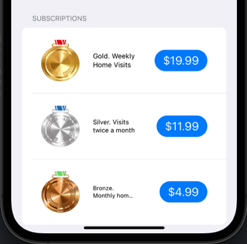

And subscription purchasing works correctly too:

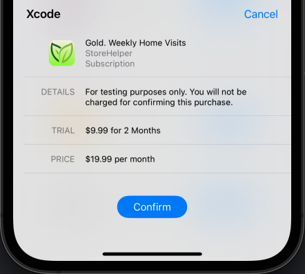

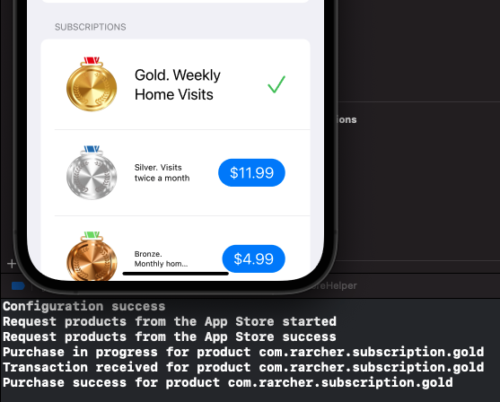

Notice that when we purchase the "Gold" subscription we can see that we'll be charged a trial rate of $9.99 for two months, a then $19.99 per month thereafter.

However, there are a few things missing:

- How does the user cancel a subscription?
- How does the user up/downgrade a subscription?
- Once a purchase has been made there's no information displayed on trials, how long a subscription lasts, when it renews and how much it costs

Let's fix that. 

TODO

# Displaying detailed Subscription information

TODO

---

# What Next?
I'll be updating this demo shortly to add support for:

- Automatically handling customer **refunds**
- Exploring detailed **transaction information and history**
- Sandbox improvements

